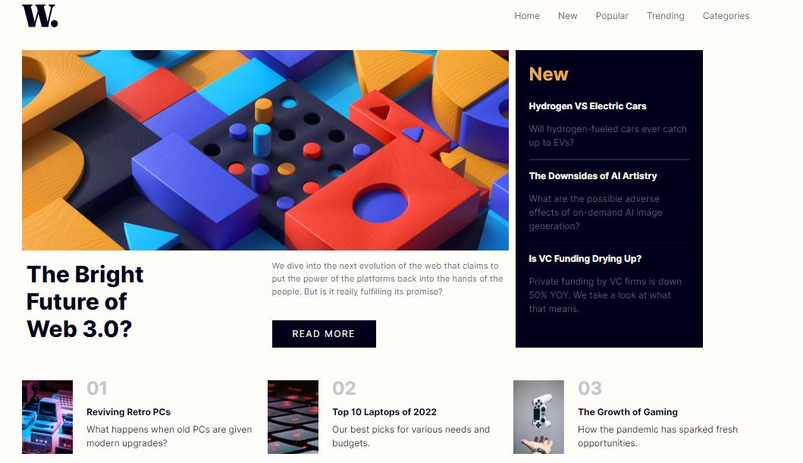

  <h1>Frontend Mentor</h1>
  <h2 align="center">News homepage solution</h2>

### The challenge

Users should be able to:

- View the optimal layout for the interface depending on their device's screen size
- See hover and focus states for all interactive elements on the page

### Screenshot

This is a solution to the [News homepage challenge on Frontend Mentor](https://www.frontendmentor.io/challenges/news-homepage-H6SWTa1MFl). Frontend Mentor

### Links

- Solution URL: [Add solution URL here](https://your-solution-url.com)
- Live Site URL: [Add live site URL here](https://your-live-site-url.com)

### Built with

- React
- Bootstrap

## Author

- Github - [Mahmoud Magdy](https://github.com/ememVII)
- Frontend Mentor - [@ememVII](https://www.frontendmentor.io/profile/ememVII)